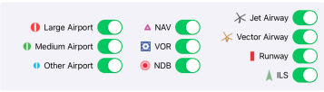
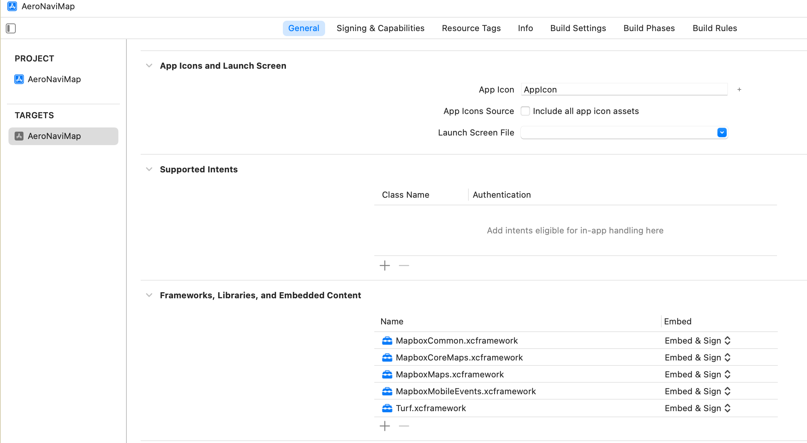
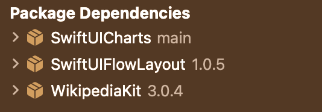

## Readme - AeroNaviMap

### Team Member:

Yuankai Zhu
Yingxu Wang

### Project Description

We create this AeroNaviMap to enable users for flight simulation. This project contains interactive annotation as well as plenty of operations that users can use to do flight simulation.

### Device Requirement

* iPad with iOS 15.0 or above.
* Best experience by iPad 12.9‘ in landscape mode.

### Key Functions

1. **Annotation Display Manual Control**
We offer 7 different types of annotations: 
Points: 1) Large Airport 2) VOR 3) NAV 4) NDB\
Polyline: 1) Airway 2) Runway\
Polygon: 1) ILS

Initially all the annotations will be displayed with their ID (for airport, ICAO Code namely ID) nearby. And you can choose to display and hide any of them by clicking the toggle in the following area.

2. **Annotation Display Automatic Control**
When users zoom in and zoom out the map, at a certain zoom level, some annotations will be hidden and some annotaion will be displayed. It is controlled automatically in the code we wrote.

3. **Different Map Type Options**
Users can choose different types of maps
    1) Topographic
    2) Street
    3) Satellite
    4) Satellite Streets

4. **Interactive Annotations**
- When clicking on annotations in the map, we will display detail information of that annotation in the left side.
- For different types of annotation, we will have different detail page content. All of them are done by using SQL to query the database, fetch the result, concatenate them and display.
- Supported annotations for detail information: Large Airport, Medium Airport, Other Airport, NAV, VOR, NDB.
- Click any place without annotation on the map to close the left info panel. 

5. **Runways for Each Airport**
 - For each airport, we query a different database table and query all the runways that are related to that airport. Then we display all of them in the second tab: Runway.

 6. **Wikipedia for Each Airport**
 - For each airport, when clicking, we will fetch the name of that airport from the database and call the Wikipedia Rest API. It will return the JSON file and we decode taht JSON to get the URL of the Wikipedia page which contains the information of this airport if avliable. Then, we use a SafariView to display that Wikipedia page in the third tab: Wikipedia.
 - Note that when we cannot get the WWikipedia of a certain airport, we won't display the Wikipedia page.

 7. **Search for Annotation**
* Click the search button at the top ribbon view to open/close search panel. 

- We enable users to search for different annotations that exist in the map: Airport, NAV, VOR, NDB, Airway, ILS. The input requirement for different types of annotations are different.
- 1) Airport: You can search using the Name, ICAO code, City, State, Region to search for a certain airpot. ICAO code is the identification for each airport. It is the abbreviation of International Civil Aviation Organization Airport Code. 
   *Example Search*: Name: Flagstaff Pulliam; ICAO: KFLG; City: Flagstaff; State: Arizona; Region: K2
- 2) NAV: You can search using the NAV ID. 
   *Example Search*: ID: ECATY. 
- 3) VOR: You can search using the Name, ID and Region. 
   *Example Search*: Name: ROCK SPRINGS; ID: OCS; Region: K1
- 4) NDB: You can search using Name, ID and Region.
  *Example Search*: Name: WENZ; ID: PNA; Region: K1
- 5) Airway: You can search using Airway Name. The map camera will be direct to the start point of this airway. 
  *Example Search*: Airway Name: A1. 
- 6) ILS: You can search using Airport ICAO. It will display all ILS related to that airport.
  *Example Search*: Airport ICAO: LUKK.
  Note that not all the airport contains ILS. But you can try to look for them in the maps also to test.

8.  **Create Flight Plan**
- We enable users to create their own flight plan by clicking the Flight Plan button in the top ribbon view.
- You can click the Flight Plan button again to close Flight Plan panel if it is open. 
- The robbin view on the top will automaticly hide. If you want to expend it, click + at the upper-right coner. 
- We allow users to add waypoints and airways to the route. 
- We support adding Large Airport, Medium Airport, Other Airport, NAV and VOR to the route. If there are available airways, you can choose from the "Suggested Next Airway" to add it to the flight plan. You can have a look at our demo video at 1:10:00 to get more ideas about adding an airway to the route.
- However, if you cannot find any suggested airways, you can simply connect next waypoints by manually search the next pont’s ID at “Any ID” text field and select found result you want. In this situation, there will be a DIRECT label added before this manually inputed point. It means you don't follow existing airways and this is a direct way you created. 
- Route List, Suggested Next Airway List, Suggested Next Waypoint List, Found Airport List, Found Waypoint List are all scrollable.  
- For meaningfully use, you should add in this order: Depart Airport, (DIRECT), Waypoint, Airway, Waypoint, Airway, ... ... , Waypoint, (DIRECT), Destination Airport.

*Example Flight Plan*: 
KCNO (Manually Search ID, Depart Airport) - (DIRECT) - PDZ (Manually Search ID) - J50(Suggested Next Airway) - YCDIL (Suggested Next Waypoint) - J50 (Suggested Next Airway) - WBERG (Suggested Next Waypoint) - J50 (Suggested Next Airway) - BLH (Suggested Next Waypoint) - J50 (Suggested Next Airway) - SALOM (Suggested NextWaypoint) - J169 (Suggested Next Airway) - KOFFA (Suggested Next Waypoint) -  (DIRECT) - BXK (Manually Search ID) - J212 (Suggested Next Airway) - TFD (Suggested Next Waypoint) - V105 (Suggested Next Airway) - BASER (Suggested Next Waypoint) - V105 (Suggested Next Airway) - ALMON (Suggested Next Waypoint) - (DIRECT) - ELAXE - (DIRECT) - KTUS (Manually Search ID, Destination Airport)

9. **Draw Flight Plan In the Map**
- During the time users are adding waypoints, we will draw blue lines in the map correspondingly. 

10. **Redirect to each Waypoint**
 - After clicking the orange or dark blue label in the route, i.e., each waypoint or airport, you can go to the corresponding location of each point.
 - Currently we don't support click of DIRECT label. When you click the airway (green label), the map camera will direct to the start point of this airway.

 11. **Delete Waypoint and Airway Added**
- After clicking the "Delete" button, you can delete waypoint or airway you added before.

12. **Flight Summary**
- After clicking "Done" button, it will display a new page summarizing the flight plan entered. 
- It will display all the waypoints and airways in the flight route and the coordinate of each waypoint. 
- It will also calculate the total distance of this flight plan.
- It will then display the minimum altitude airplane should have during this flight plan. We plot this graph by the altitude data of airway in database. Therefore, if users does not choose suggested airway between 2 waypoints, namely it is a DIRECT way, there will be no minimum altitude for this direct way user creaded in database and we will only keep pervious minimum altitude at this direct way, because we don't have altitude value for these two points in database.

13. **User Data Cache**

* The route of the flight plan will be preserved in our application so that every times you open the flight plan, it will keep last inputed route. 
* You can delete the route and create new route as you wish.

 

This project is supported by following packages: 

**[Mapbox Map iOS](https://docs.mapbox.com/ios/maps/guides/)**

**[Swiftui Flow Layout](https://github.com/globulus/swiftui-flow-layout)**

**[SwiftUICharts](https://github.com/willdale/SwiftUICharts)**

**[WikipediaKit](https://github.com/Raureif/WikipediaKit)**

Before you run the project:

1. Make sure all frameworks for the builded target are “Enabled & Sign”. You can check as following:

2. Swiftui Flow Layout, SwiftUICharts and WikipediaKit are successfully added by Swift Package Manager in project navigator panel with version equal or above following.

   

